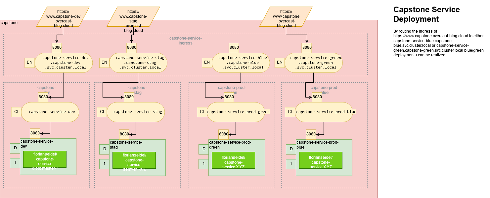

# Repository Overview

This is the deployment config repository for the [Udacity Cloud DevOps Nano Degree](https://www.udacity.com/course/cloud-dev-ops-nanodegree--nd9991).
It is managed using [GitOps](https://www.weave.works/technologies/gitops/) using [Flux](https://www.weave.works/oss/flux/) for the final (capstone) project.
It also contains the Jenkinsfile for building the service.

There are three other repositories 
* [DevOps_Capstone](https://github.com/FlorianSeidel/DevOps_Capstone):  Main repository. Setup and high-level documentation
* [DevOps_Capstone_Service](https://github.com/FlorianSeidel/DevOps_Capstone_Service): Contains a Quarkus toy micro-service and the Jenkins pipeline
* [DevOps_Capstone_Repo](https://github.com/FlorianSeidel/DevOps_Capstone_Repo): Helm Repository for the project

# Kubernetes Deployment Config

Notation: [KDL](https://github.com/raffaelespazzoli/kdl)



# GitOps and Flux

The deployments of capstone-service are partially automated by Flux.
The deployments to the development environment are fully automated.
Deployments to staging are partly automated. Only patch versions are updated automatically. Major and minor version
updates have to be triggered manually.
For production deployments, the update has to be triggered manually. See next section for details.

# Blue/Green deployment

As indicated in the diagram in the previous section, it is possible to do
blue/green deployments of the capstone-service. Assuming the current production deployment runs in 
 the green environment, a new version can be deployed as follows:

1. Update chart and/or image version in releases/capstone-prod-blue/capstone-service.yaml
2. Tag, commit and push to the repository.<br>
   ``` git tag blue-deploy:capstone-service:X.Y.Z -n "Deploy capstone-service:X.Y.Z to blue" ```<br>
   ``` git commit -m "Deploy capstone-service:X.Y.Z to blue" ```<br>
   ``` git push --tag" ```<br>
3. ``` flux sync ``` to sync the cluster with git 
4. Perform tests
5. Re-route ingress from green deployment to blue deployment by editing releases/capstone-ingress/capstone-ingress.yaml
6. Tag, commit and push to the repository.<br>
      ``` git tag blue-release:capstone-service:X.Y.Z -n "Release capstone-service:X.Y.Z in blue" ```<br>
      ``` git commit -m "Release capstone-service:X.Y.Z in blue" ```<br>
      ``` git push --tag" ```<br>
7. ```flux sync``` to sync the cluster with git

